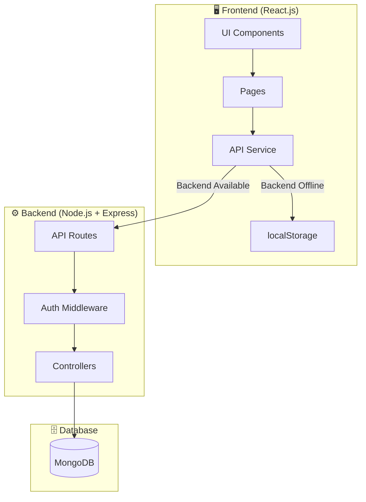
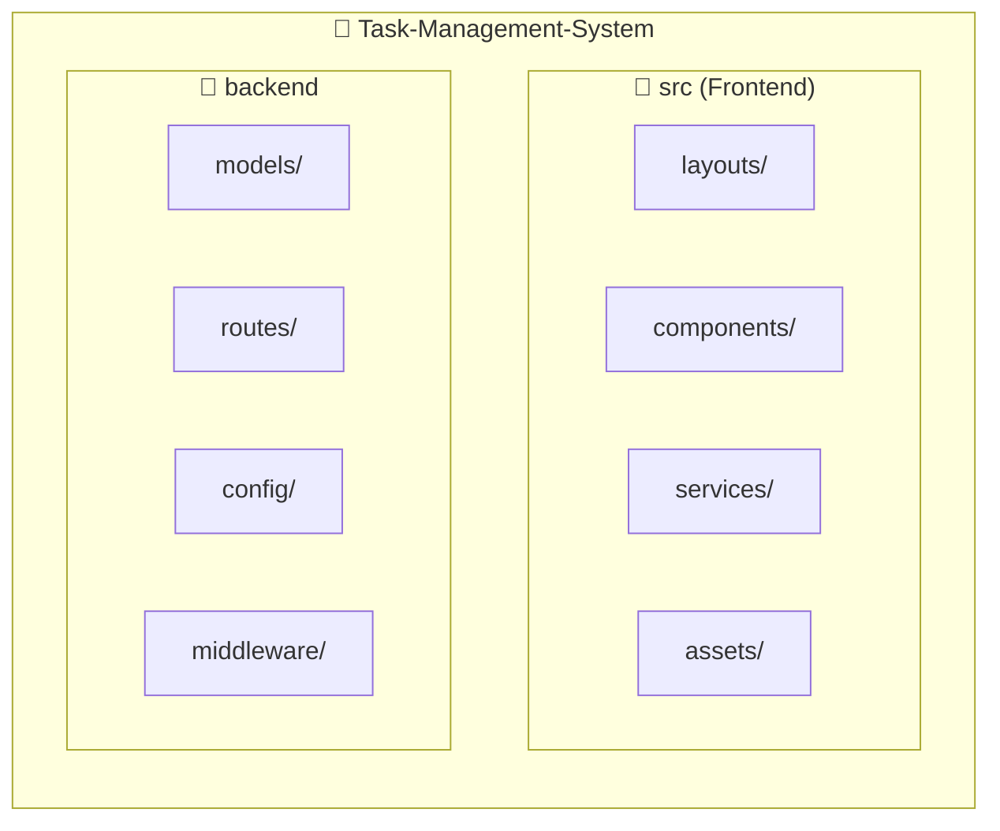
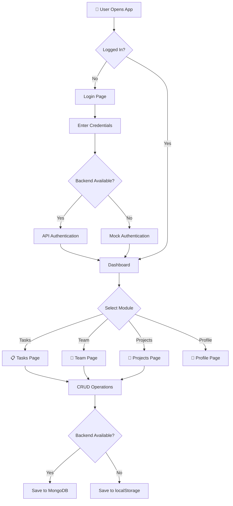

# � Task Management System

A comprehensive **full-stack Task Management System** built with React.js and Node.js, featuring team collaboration, project tracking, and a modern UI with dark mode support.

---

## 🚀 Features

| Feature | Description |
|---------|-------------|
| ✅ **Tasks** | Create, update, delete, and track tasks with priorities and statuses |
| 👥 **Team** | Manage team members with roles, departments, and contact info |
| 📁 **Projects** | Track projects with progress bars, deadlines, and task counts |
| 👤 **Profile** | Edit user profile with settings and preferences |
| 🌙 **Dark Mode** | Toggle between light and dark themes |
| 🔐 **Authentication** | Secure login with JWT tokens |
| 📊 **Dashboard** | Statistics and overview of all activities |
| 🔄 **Mock Data** | Works offline with localStorage fallback |

---

## 🏗️ System Architecture



---

## 📂 Project Structure



### Frontend Structure
```
src/
├── layouts/
│   ├── auth/           # Login, Register, Logout
│   ├── dashboard/      # Dashboard page
│   ├── tasks/          # Tasks list & details
│   ├── team/           # Team members
│   ├── projects/       # Projects management
│   └── profile/        # User profile & settings
├── components/
│   ├── sidenav/        # Sidebar navigation
│   └── navbar/         # Top navigation bar
├── services/
│   └── api.js          # Unified API service
└── assets/             # Images and icons
```

### Backend Structure
```
backend/
├── models/
│   ├── users.js        # User model
│   ├── tasks.js        # Task model
│   ├── projects.js     # Project model
│   ├── teamMembers.js  # Team member model
│   └── employees.js    # Employee model
├── routes/
│   ├── auth.js         # Authentication routes
│   ├── task.js         # Task CRUD routes
│   ├── project.js      # Project CRUD routes
│   ├── team.js         # Team CRUD routes
│   └── dashboard.js    # Dashboard routes
├── middleware/
│   └── auth.js         # JWT authentication
└── config/
    └── db.js           # MongoDB connection
```

---

## 🔄 Application Flow



---

## 🛠️ Tech Stack

### Frontend
| Technology | Purpose |
|------------|---------|
| React.js | UI Framework |
| React Router | Navigation |
| Chakra UI | Component Library |
| Axios | HTTP Client |
| React Icons | Icon Library |

### Backend
| Technology | Purpose |
|------------|---------|
| Node.js | Runtime |
| Express.js | Web Framework |
| MongoDB | Database |
| Mongoose | ODM |
| JWT | Authentication |
| bcrypt | Password Hashing |

---

## 📡 API Endpoints

### Authentication
| Method | Endpoint | Description |
|--------|----------|-------------|
| POST | `/api/login` | User login |
| POST | `/api/register` | User registration |
| GET | `/api/me` | Get current user |
| GET | `/api/health` | Health check |

### Tasks
| Method | Endpoint | Description |
|--------|----------|-------------|
| GET | `/api/tasks` | Get all tasks |
| GET | `/api/task/:id` | Get single task |
| POST | `/api/task` | Create task |
| PUT | `/api/task/:id` | Update task |
| DELETE | `/api/task/:id` | Delete task |
| GET | `/api/tasks/summary` | Get task statistics |

### Projects
| Method | Endpoint | Description |
|--------|----------|-------------|
| GET | `/api/projects` | Get all projects |
| GET | `/api/projects/:id` | Get single project |
| POST | `/api/projects` | Create project |
| PUT | `/api/projects/:id` | Update project |
| DELETE | `/api/projects/:id` | Delete project |

### Team
| Method | Endpoint | Description |
|--------|----------|-------------|
| GET | `/api/team` | Get all team members |
| GET | `/api/team/:id` | Get single member |
| POST | `/api/team` | Add team member |
| PUT | `/api/team/:id` | Update member |
| DELETE | `/api/team/:id` | Remove member |

---

## 🚀 Getting Started

### Prerequisites
- Node.js (v14+)
- MongoDB
- npm or yarn

### Installation

1. **Clone the repository**
```bash
git clone https://github.com/your-username/Task-Management-System.git
cd Task-Management-System
```

2. **Install Frontend Dependencies**
```bash
npm install
```

3. **Install Backend Dependencies**
```bash
cd backend
npm install
```

4. **Configure Environment Variables**

Create `backend/.env`:
```env
MONGODB_URI=mongodb://localhost:27017/taskmanagement
JWT_SECRET_KEY=your_secret_key
PORT=8000
```

5. **Start MongoDB**
```bash
mongod
```

6. **Start Backend Server**
```bash
cd backend
npm start
```

7. **Start Frontend**
```bash
npm start
```

---

## 🌐 Running the App

| Service | URL |
|---------|-----|
| Frontend | http://localhost:3000 |
| Backend | http://localhost:8000 |
| API Health | http://localhost:8000/api/health |

---

## 🌙 Dark Mode

The app supports system-wide dark mode. Toggle it from the **Profile** page:

1. Navigate to Profile (`/admin/profile`)
2. Find "Dark Mode" toggle in App Settings
3. Switch between Light and Dark themes
4. Setting persists across page refreshes

---

## � Screenshots

### Dashboard
- Statistics overview
- Quick access cards
- Recent activities

### Tasks
- Task cards with priorities
- Status badges
- Add/Edit/Delete operations

### Team
- Team member cards
- Role badges
- Contact information

### Projects
- Progress tracking
- Deadline management
- Task counts

---

## 🤝 Contributing

1. Fork the repository
2. Create your feature branch (`git checkout -b feature/AmazingFeature`)
3. Commit your changes (`git commit -m 'Add some AmazingFeature'`)
4. Push to the branch (`git push origin feature/AmazingFeature`)
5. Open a Pull Request

---

## � License

This project is licensed under the MIT License.

---

## 👨‍💻 Author

**Ashok**

---

⭐ **Star this repo if you found it helpful!**
